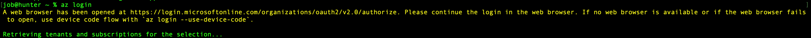
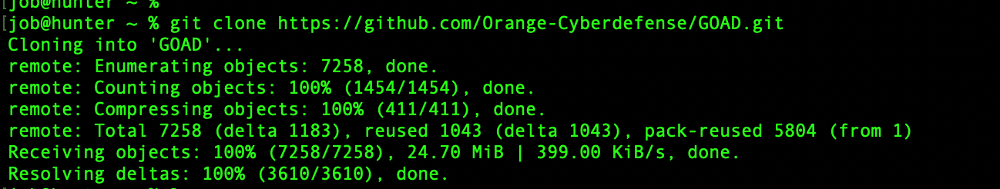
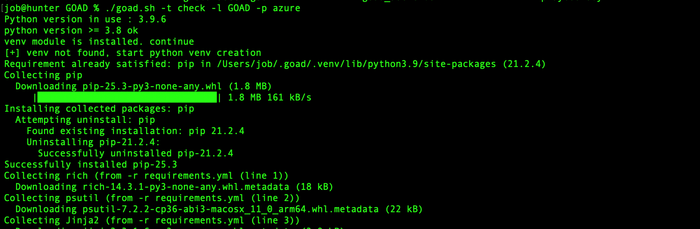
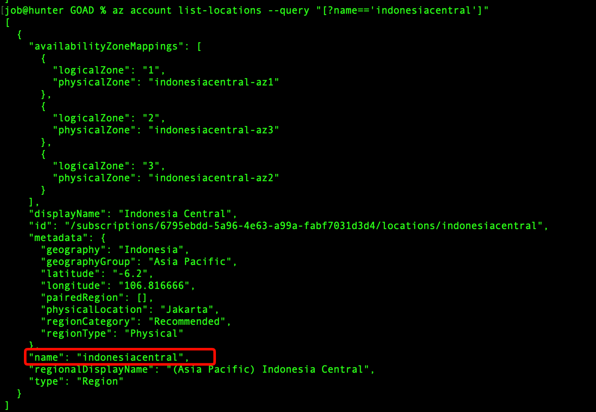
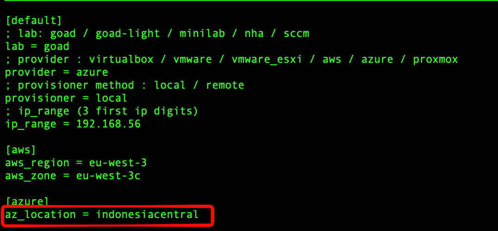
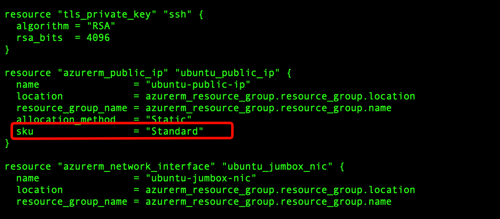
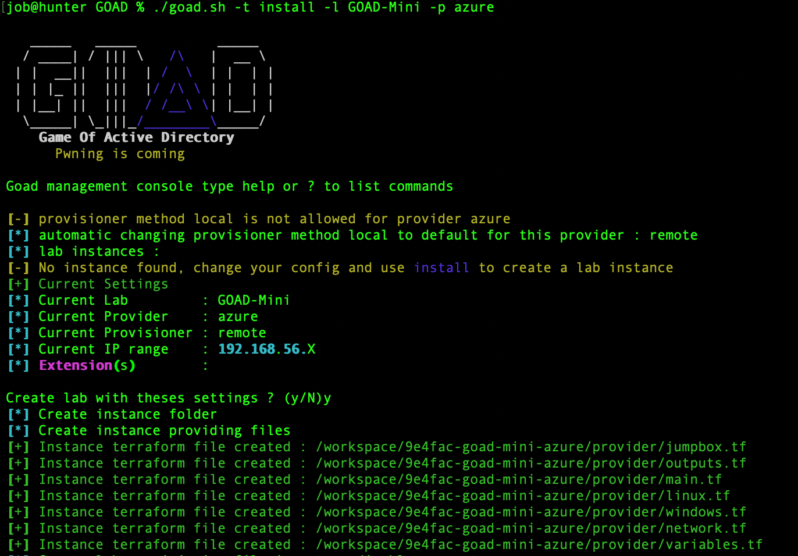
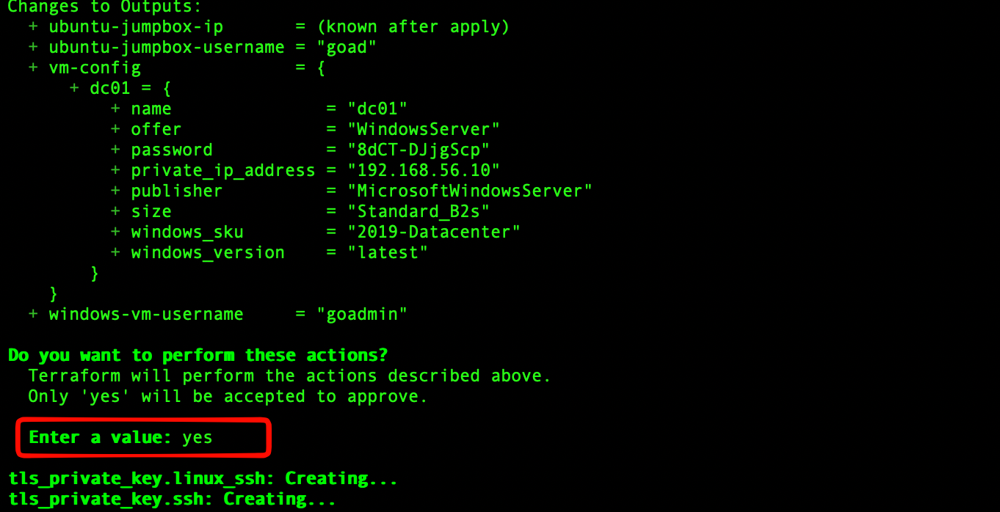
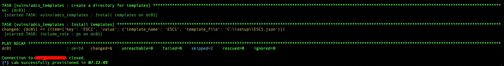
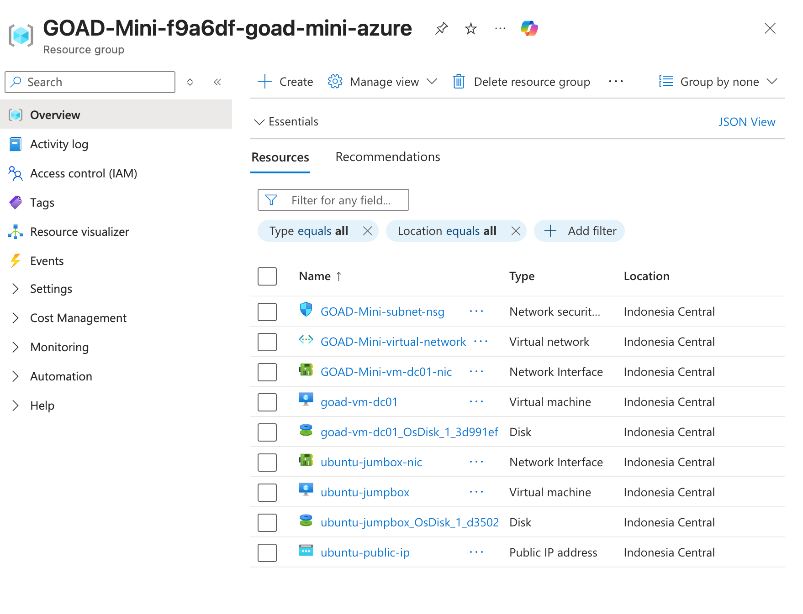

# GOAD (Game of Active Directory) Installation Notes - Azure (macOS)

## Description
This document outlines the step-by-step process to deploy the **Game of Active Directory (GOAD)** environment on Microsoft Azure using a macOS workstation.

**GOAD** is a vulnerable Active Directory lab created by Orange Cyberdefense, designed for practicing penetration testing and Red Teaming techniques. These notes specifically cover the **GOAD-Mini** configuration on Azure, but the steps are similar for the full GOAD labs.

**⚠️ Cost Warning:** deploying this lab on Azure creates real resources (VMs, Networking, Storage) which incur hourly costs. Ensure you run the **Cleanup** step immediately after you are done practicing to avoid unexpected charges.

---

## 1. Prerequisites

First, ensure the Azure CLI is installed and authenticated.

### Install Azure CLI
```bash
brew install azure-cli
```


### Authenticate
```bash
az login
```


## 2. Setup & Requirements
### Clone the repository

Clone the official GOAD repository from Orange Cyberdefense.
```bash
git clone https://github.com/Orange-Cyberdefense/GOAD.git
```


### Check Requirements

Navigate to the directory and run the check script to ensure all dependencies are met for Azure
```bash
cd goad
./goad.sh -t check -l GOAD -p azure
```


## 3. Configuration
### Check region availability
Verify if your desired location (e.g., indonesiacentral) is available for your subscription.
```bash
az account list-locations --query "[?name=='indonesiacentral']"
```


### Configure goad.ini
Edit the main configuration file to set your project details, IP ranges, or locations.
```bash
nano /Users/<your_user>/.goad/goad.ini
```


### Configure Terraform (Jumpbox)
If specific Terraform modifications are needed for the jumpbox, edit the provider file.
```bash
nano ./template/provider/azure/jumpbox.tf
```


## 4. Deployment
### Install GOAD
Run the installation script.
Target: ``install``
Lab: ``GOAD-Mini`` (Change to GOAD for the full lab)
Provider: ``azure``
```bash
./goad.sh -t install -l GOAD-Mini -p azure
```



Wait until completed

*Note*: This process may take some time (approx. 30-45 mins).

## 5. Verification
Once the script finishes:
1. Check your Azure Resource Groups to confirm resources were created.
2. Connect to the environment and enjoy!


## 6. Cleanup
*Important*: Azure charges by the hour. Destroy the lab when you are finished to avoid unexpected costs.

### Destroy the Lab
Run the script with the destroy target. Ensure you match the Lab name used during installation.
```bash
./goad.sh -t destroy -l GOAD-Mini -p azure
```
### Double Check
Always log in to the Azure Portal or use the CLI to confirm the Resource Group has been deleted.
```bash
az group list --output table
```

